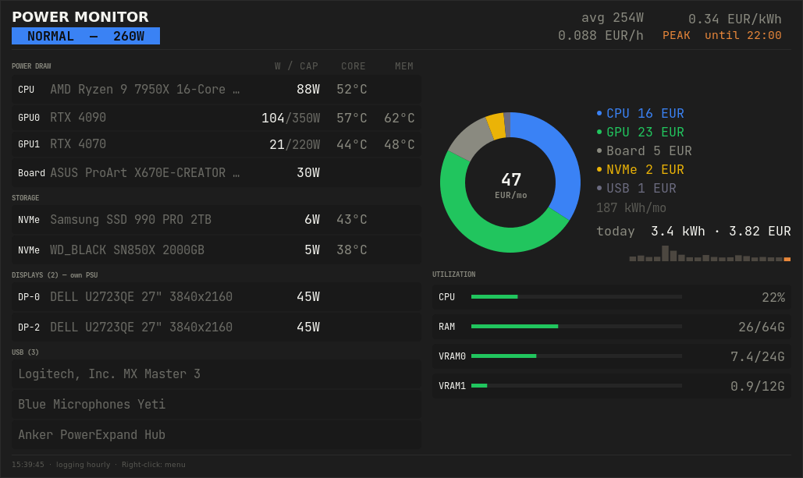
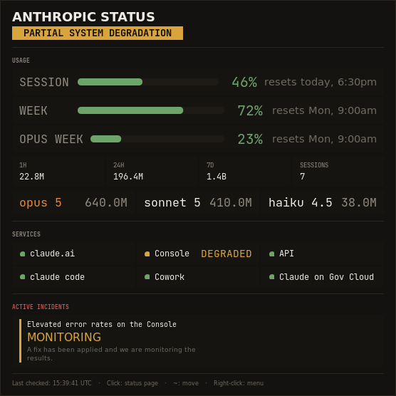
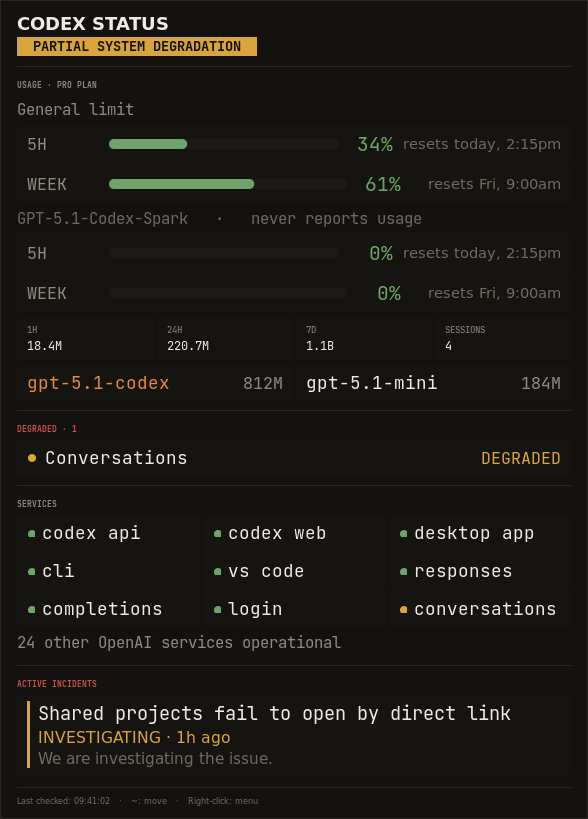
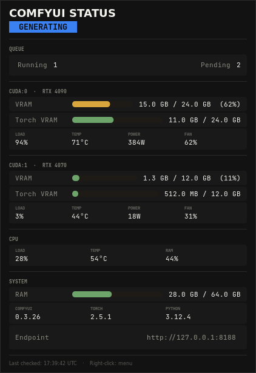
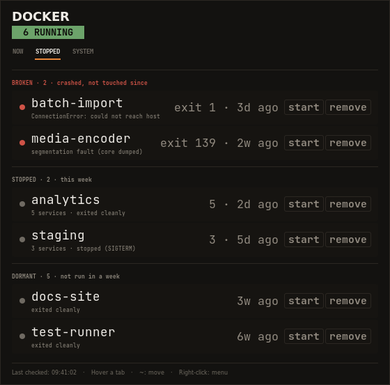
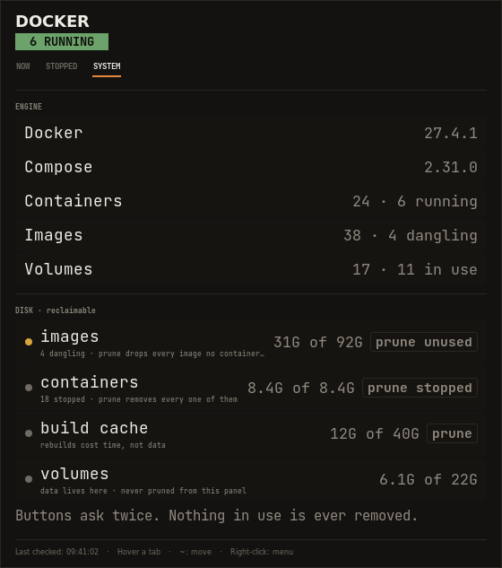

<p align="center">
  
  
  
  
  
  
  
</p>

<h1 align="center">NoClickDock</h1>
<p align="center"><strong>NCD Status</strong> — every piece of information you need, with literally no click.</p>

<p align="center">
  
  &nbsp;&nbsp;&nbsp;
  
</p>

<p align="center"><sub>The dock, and one panel open on hover. Every widget is shown in full in the table below.<br />All images are mockups from invented data — see <a href="#screenshots">Screenshots</a>.</sub></p>

---

A dock of small always-on-top status dots for your desktop. Each dot is one thing you care about — Claude, Codex, ComfyUI, your disks, Docker, the machine's power draw, your tailnet — drawn as its real logo with a chat-app style status bubble in the corner. Glance at the dock and you know. Hover a dot and the full picture opens beside it. You never click.

The concept is the UX rule: **if you have to click to find out, the widget has failed.** Colour is used only for signal, never decoration; a healthy dock is quiet and a problem is the only thing that moves.

- **The dock** holds every running widget in one pill, vertical or horizontal, three densities, drag to move. Any widget you start shows up in it by itself; any widget you quit leaves it. No configuration.
- **The bubble** is the status: green fine · yellow degraded · red failing · grey unknown. A slow breathing ring around the disc appears only while something is actually wrong.
- **The panel** opens on hover, perpendicular to the dock so it never covers the other dots, and closes when you leave. Problems are listed first and in full; the healthy majority is condensed.
- **Toasts** appear next to the dot on transitions — a service degrading, a container going unhealthy, a GPU crossing a temperature — so you find out while you can still act.
- **Right-click** is the only menu: *Refresh now*, the widget's own actions, and *Quit* behind a separator.

Zero pip dependencies. Python 3 plus the system GTK3, and the CLI of whatever each widget watches.

## The widgets

<table>
<tr><th width="360">Widget</th><th>What the panel shows</th></tr>
<tr>
<td align="center" valign="top"><br /><strong>Claude</strong></td>
<td valign="top"><strong>Watches</strong> Anthropic status page, your plan limits, local token spend<br /><br />Usage first: session / week / per-model windows as one-line meters with reset times, token spend as stat tiles, model split. Then every Anthropic service as a chip grid — only a non-operational one gets words. Active incidents with their latest update.<br /><br /><sub>Polls every 30 s. Right-click: open status page.</sub></td>
</tr>
<tr>
<td align="center" valign="top"><br /><strong>Codex</strong></td>
<td valign="top"><strong>Watches</strong> OpenAI status page, your plan limits, local token spend<br /><br />Usage first: each rate-limit window as a meter with its reset time, read from the last Codex turn on this machine; token spend over 1h / 24h / 7d and the model split from the local session rollouts. Then the Codex-facing services — API, web, desktop app, CLI, VS Code, Responses, Completions, login — as a chip grid; any OpenAI service that is not operational gets words, and active incidents their latest update.<br /><br /><sub>Polls every 30 s. Right-click: open status page.</sub></td>
</tr>
<tr>
<td align="center" valign="top"><br /><strong>ComfyUI</strong></td>
<td valign="top"><strong>Watches</strong> A ComfyUI server (<code>--host</code>, <code>--port</code>), its queue and hardware<br /><br />Queue running / pending, then every CUDA device with VRAM and Torch VRAM meters, load, temperature, power, fan; CPU and RAM; ComfyUI / Torch / Python versions; the endpoint. Step-by-step generation progress arrives as toasts; the disc shows a spinner while generating.<br /><br /><sub>Polls every 2 s + websocket. Right-click: open ComfyUI.</sub></td>
</tr>
<tr>
<td align="center" valign="top"><br /><strong>Disk</strong></td>
<td valign="top"><strong>Watches</strong> Every real mounted filesystem, Docker's reclaimable space<br /><br />Used / free / total per filesystem with thick meters (yellow at 85 %, red at 92 % — filesystems misbehave long before 100 %), and how much <code>docker system df</code> says you could free, with the prune commands. Never deletes anything.<br /><br /><sub>Polls every 30 s. Right-click: open Disk Usage Analyzer.</sub></td>
</tr>
<tr>
<td align="center" valign="top"><br /><br /><br /><strong>Docker</strong></td>
<td valign="top"><strong>Watches</strong> Every container, thought of as compose <strong>stacks</strong>; the engine and its disk<br /><br />Three pages, switched by hovering a tab. <strong>NOW</strong>: <strong>needs attention</strong> (unhealthy, restart-looping, crashed today — exit code, OOM flag, restart count, when, and the container's last log line), then <strong>running</strong> as one row per stack (<code>7/7 up</code>) or container with image, published port, health, live memory and CPU. <strong>STOPPED</strong>: every stack that is not running — <strong>broken</strong> (crashed, with the exit code and last log line), <strong>stopped this week</strong>, <strong>dormant</strong> — nothing collapsed, the page scrolls. <strong>SYSTEM</strong>: engine and Compose versions, container / image / volume counts, and what <code>docker system df</code> says is reclaimable. Every row carries <code>start</code> / <code>stop</code> / <code>restart</code> / <code>remove</code> buttons and the SYSTEM page <code>prune</code> buttons; each has to be clicked twice — the first click only arms it (<code>stop?</code>, <code>remove?</code>) — and volumes are never touched. Exit 143 / 137 are recognised as <code>docker stop</code>, not failures.<br /><br /><sub>Polls every 20 s. Right-click: open Portainer, when it runs.</sub></td>
</tr>
<tr>
<td align="center" valign="top"><br /><strong>Power</strong></td>
<td valign="top"><strong>Watches</strong> CPU (RAPL), every GPU (nvidia-smi), drives, board, displays, USB<br /><br />Live draw per component against its power cap (<code>8/280W</code>), core <strong>and VRAM</strong> temperatures, a monthly cost donut split by component, today's kWh and cost with a 24-hour sparkline, utilisation meters, the live tariff window (peak / off-peak, until when). Toasts on thermal thresholds. Writes an hourly CSV and rebuilds a full HTML report after every write.<br /><br /><sub>Polls every 2 s. Right-click: open power report, or settings.</sub></td>
</tr>
<tr>
<td align="center" valign="top"><br /><strong>Tailscale</strong></td>
<td valign="top"><strong>Watches</strong> <code>tailscaled</code>, this node, every peer<br /><br />Health warnings first. This node's address and MagicDNS name, version (flags an available update), key expiry. Exposure: <code>serve</code> / Funnel, exit-node offers, routes. Online peers with their path — direct or which relay — and live throughput; watched peers that dropped; dormant peers, with expired keys called out.<br /><br /><sub>Polls every 30 s. Right-click: copy address, or MagicDNS name.</sub></td>
</tr>
</table>

## Install

**Linux**

```bash
git clone https://github.com/ShAInyXYZ/NoClickDock ~/Documents/GitHub/NoClickDock
cd ~/Documents/GitHub/NoClickDock
./install.sh
```

**Windows**

```powershell
git clone https://github.com/ShAInyXYZ/NoClickDock $HOME\Documents\GitHub\NoClickDock
cd $HOME\Documents\GitHub\NoClickDock
.\install.ps1
```

Both installers behave the same way and print the same table.

The installer shows a table of what is installed, at which version, and what this checkout offers, and you pick — nothing happens to a widget you did not select:

```
  #   widget      installed  available            status
 *1   Dock        1.0.0      1.0.0                up to date
 *2   Claude      —          1.0.0                not installed
  3   ComfyUI     legacy     1.0.0     running    upgrade: runs from ~/Documents/GitHub/comfyui-status-checker
  4   Disk        1.0.0      1.0.0     running    up to date
  ...
  toggle: 1-7   a=all  n=not installed  u=upgrades  c=clear
  then:   i=install/upgrade selected   r=remove selected   q=quit
```

*Install* copies the widget (and the shared core) out of the checkout and writes an autostart entry pointing at the copy, so a later `git pull` changes nothing until you choose to upgrade; the dock is installed with the first widget. *Upgrade* is the same operation on a widget whose installed version is behind, or that still runs from an old per-widget repo. *Remove* stops the widget, deletes its copy and its autostart entry, and keeps your config.

| | Linux | Windows |
|---|---|---|
| copies to | `~/.local/share/noclickdock/` | `%LOCALAPPDATA%\NoClickDock\` |
| autostarts via | `~/.config/autostart/*.desktop` | a shortcut in the Startup folder |
| non-interactive | `--list` `--all` `--upgrade` `--install docker tailscale` `--remove comfyui` | `-List` `-All` `-Upgrade` `-Install docker,tailscale` `-Remove comfyui` |
| and | `--start` / `--no-start` | `-Start` / `-NoStart` |

Override the destination with `NCD_HOME`, and the interpreter with `PYTHON`.

Run anything by hand with the system interpreter (conda/pyenv Pythons don't see the system GTK bindings):

```bash
/usr/bin/python3 dock/ncd-dock.py
/usr/bin/python3 widgets/docker/docker-status-checker.py
```

### Requirements

- Python 3.8+ and GTK3 with GObject Introspection — Debian/Ubuntu: `sudo apt install python3-gi python3-gi-cairo gir1.2-gtk-3.0`; Fedora: `python3-gobject gtk3`; Arch: `python-gobject gtk3`
- A compositing window manager, X11 session (the dock moves the dots directly through X; on Wayland they fall back to following a file, a little behind the pill)
- Per widget: the `docker`, `tailscale`, `nvidia-smi` CLIs as applicable, reachable as your user (`docker info` must work)
- Fonts: JetBrains Mono and Inter, with DejaVu fallbacks

### Windows

GTK3 on Windows comes from [MSYS2](https://www.msys2.org/), so the Python that can draw these widgets is usually not the one on `PATH`. Install MSYS2, then in its **UCRT64** terminal:

```bash
pacman -S mingw-w64-ucrt-x86_64-python-gobject mingw-w64-ucrt-x86_64-gtk3
```

`install.ps1` finds that interpreter itself and says so in the table; if MSYS2 is not at `C:\msys64`, point at it with `$env:PYTHON = "D:\msys64\ucrt64\bin\python3.exe"`. Widgets are launched with `pythonw.exe` so no console window appears.

Not everything runs there. **Power** reads `/proc`, `lm-sensors` and `lsusb`, so it is listed as *not on Windows* and cannot be selected. **ComfyUI** works, but its CPU temperature and utilisation come from Linux interfaces and stay blank; the queue and every CUDA device still report. **Disk** enumerates drive letters instead of `/proc/mounts`. Claude, Codex, Docker and Tailscale need only their own CLI or config directory and behave the same on both platforms.

The dock repositions its dots by moving their X11 windows directly, which Windows has no equivalent for. It falls back to the same file-based path Wayland uses, so the dots follow the pill a poll behind rather than in the same frame.

### Optional: VRAM junction temperatures

`nvidia-smi` never exposes GDDR6X memory temperature on Linux, and on cards with aged pads it is the limit that bites first. The Power widget reads it through a tiny one-shot built on [gddr6](https://github.com/olealgoritme/gddr6):

```bash
git clone https://github.com/olealgoritme/gddr6 && cd gddr6
cp ~/Documents/GitHub/NoClickDock/widgets/power/tools/gddr6-oneshot.c app/src/
# add an executable target for it in app/CMakeLists.txt, then:
sudo apt install libpci-dev && mkdir build && cd build && cmake .. && make
sudo install -m 755 bin/gddr6-oneshot /usr/local/bin/
```

It needs root; the widget calls it with `sudo -n`, so either give your user passwordless sudo for exactly that binary or skip it — the widget shows core temperatures only and never breaks.

## Configuration

Everything lives under `~/.config/`:

| File | Owner | Purpose |
|---|---|---|
| `status-widgets/<name>.json` | each widget | Registration while running (pid, X window id). Managed automatically. |
| `status-widgets/bar.json` | the dock | Live layout: position, orientation, one slot per widget. Managed automatically. |
| `status-widgets/bar.conf` | the dock | Your orientation, density and position. Persists across restarts. |
| `status-widgets/tailscale.json` | you | `{"watch": ["shiny-nas", "build-box"]}` — the peers that may raise alerts. Without it, any peer seen online while running is watched. |
| `power-monitor/config.json` | you | Tariff (`price_per_kwh`, `currency`, or `tou` with `peak_rate` / `off_peak_rate` / `peak_hours` / `tou_weekend_offpeak`), the overhead / peripheral / display estimates, poll and log intervals. |

The Power widget logs to `~/Documents/PM-Log/<YYYY-MM>/<date>.csv` and rebuilds `power-consumption-report.html` there after every hourly write and on click — every sentence in that report is computed from the data, priced with the current tariff. The generator and template are versioned in `widgets/power/report/`.

## Adding a widget

The shared runtime in `core/shinywidget.py` does everything except the data: the dot, the bubble, the dock handshake, the panel chrome, toasts, the menu. A new widget is a subclass that says what to fetch and how to lay it out:

```python
from shinywidget import WidgetApp, Section, Row, Meter, Grid, Note, OK, WARN, CRIT, IDLE, run

class NasWidget(WidgetApp):
    name = "nas"                 # registration key; also the order in the dock
    title = "NAS"
    poll_secs = 30
    brand = (0.14, 0.14, 0.14)   # disc colour — the brand's, constant
    logo_fg = (0.94, 0.93, 0.90) # mark colour
    glyph = "M12 2 ..."          # SVG path of the mark (24-box)

    def fetch(self):             # background thread: return a dict
        ...
    def state(self, data):       # "ok" | "warn" | "crit" | "idle" -> the bubble
        ...
    def rows(self, data):        # the panel, top to bottom
        return [Section("SHARES"), Meter("/volume1", 0.62, "1.9T free"), ...]
    def menu_items(self, dot):   # optional right-click extras
        return [("Open DSM", lambda: webbrowser.open("https://nas:5001"))]

run(NasWidget)
```

Put it in `widgets/<name>/` with a `__version__`, add its logo to `assets/logos/`, a row to the table above, and a line to `ENTRIES` in `install.sh`. Start it and it appears in the dock.

## Design

Emberdeck: warm charcoal (`#0e0d0b`, never pure black, never blue-black), a flat three-step surface ladder with 1 px hairlines for depth — no shadows, no gradients, no glow. One accent, ember amber `#e8873a`, and it means something every time it appears. Numbers in JetBrains Mono, prose in Inter. Green / yellow / red carry state and nothing else does.

## Screenshots

Every image in this repository is a mockup. A status panel's whole job is to show what you are running, so a screenshot of a real one publishes container names, hostnames, tailnet addresses, mounted filesystems and hardware. Regenerate them with the real widget code and invented data instead:

```bash
./tools/make-mockups.py            # every panel, plus the dock
./tools/make-mockups.py docker     # just one
```

The panels are drawn by the same `PanelWindow` the widgets use and the dock is composited from the logos in `assets/logos/`, so a change to the chrome shows up here without anyone pointing a camera at their own desktop. **Please do not replace these with captures of a live machine.**

## License

MIT — see [LICENSE](LICENSE).
