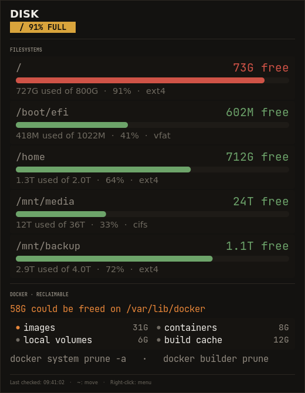

<p align="center">
  
</p>

<p align="center">
  <strong>ShinyWidgets</strong> — Disk Status Checker
</p>

<p align="center">
  <em>Real-time desktop widgets for your creative pipeline</em>
</p>

<p align="center">
  
  
  
  
</p>

---

A lightweight, always-on-top desktop indicator for **filesystem pressure** — and for the space Docker is quietly sitting on. A full root filesystem breaks builds, package installs and image pulls in confusing, hard-to-diagnose ways. This is the warning you get *before* that happens.

> **Part of the [ShinyWidgets](https://github.com/ShAInyXYZ) series** — small, focused desktop widgets that let you know what's happening in your software and pipeline at a glance. Zero clutter, zero noise, just the info you need.

---

<p align="center">
  
</p>


## What It Does

| Dot Color | Meaning |
|:-:|---|
| **Green** | Every filesystem below 85% |
| **Yellow** | A filesystem at 85% or above |
| **Red** | A filesystem at 92% or above |
| **Grey** | No filesystems readable |

## Features

- **Per-filesystem meters** — every real mounted filesystem with a fill bar, percentage, and free-of-total. Pseudo-filesystems (`tmpfs`, `squashfs`, `overlay`, snaps) are filtered out because they tell you nothing about capacity
- **Docker reclaimable** — how much `docker system df` says you could free, broken down by images / containers / volumes / build cache, with a prune hint once it passes 20G
- **Toasts on crossing** — a filesystem passing 85% raises a notification, so you find out while you can still act
- **Draggable · multi-monitor · `~` to reposition** — shared with every other ShinyWidget
- **Lightweight** — zero pip dependencies, Python standard library plus system GTK3

## Why 85% and 92%?

Filesystems misbehave well before they read 100%. Ext4 reserves 5% for root by default, allocation gets slower and more fragmented as free space shrinks, and copy-on-write filesystems can fail to *delete* when completely full. 85% is "plan a cleanup", 92% is "do it now".

## Usage

```bash
./disk-status-checker.py

# or with system python (recommended if using conda/pyenv)
/usr/bin/python3 disk-status-checker.py
```

### Controls

| Action | Effect |
|---|---|
| **Hover** | Opens the status detail panel |
| **Click + Drag** | Repositions the dot |
| **`~` key** | Cycles all ShinyWidgets through screen sides (left/right, all monitors) |
| **Right-click** | Menu: refresh, widget actions, quit |

### Reclaiming space

The panel tells you what's reclaimable; it never deletes anything itself. To act on it:

```bash
docker system df            # the detail behind the panel's numbers
docker builder prune        # build cache only - safest, often the biggest win
docker image prune -a       # images not used by any container
docker system prune -a      # everything unused, including volumes if you add --volumes
```

> `docker system prune -a` removes every image not backing a running container — including ones you'd have to pull or rebuild. Read what it lists before confirming.

## Requirements

- Python 3.8+
- GTK3 with GObject Introspection
- Compositing window manager (for RGBA transparency)

The app **auto-detects your platform** at startup and adjusts accordingly. If GTK3 is missing, it prints platform-specific installation instructions.

<details>
<summary><strong>Linux</strong></summary>

GTK3 is pre-installed on most Linux desktops. If not:

**Debian / Ubuntu:**
```bash
sudo apt install python3-gi python3-gi-cairo gir1.2-gtk-3.0
```

**Fedora:**
```bash
sudo dnf install python3-gobject gtk3
```

**Arch:**
```bash
sudo pacman -S python-gobject gtk3
```

> **Note:** If you use conda/pyenv/virtualenv, the system `python3-gi` package may not be visible. Run with `/usr/bin/python3` or create a venv with `--system-site-packages`.

</details>

## Widget Coordination

ShinyWidgets are designed to work together. Press **`~`** on **any** widget and they all move together, stacked vertically with a 50px gap, cycling through the left and right edges of every connected monitor.

The coordination works via a shared directory (`~/.config/status-widgets/`):
- Each widget registers itself with a JSON file on startup
- A shared `corner.json` stores the current position index
- All widgets poll this file 5 times/sec and reposition when it changes
- Stale registrations (dead PIDs) are automatically cleaned up

## How It Works

Filesystems are read from `/proc/mounts` and measured with `shutil.disk_usage()` — no shelling out, no parsing `df`. Bind mounts pointing at the same device are de-duplicated by `st_dev`.

Docker figures come from `docker system df`, which walks the image graph and is genuinely slow, so it refreshes every 5 minutes rather than on the 30-second poll. If Docker isn't installed or the daemon is unreachable, that section is simply omitted.

## ShinyWidgets Family

| Widget | Monitors | Repo |
|---|---|---|
| **Claude Status** | Anthropic API health, plan limits, incidents | [claude-status-checker](https://github.com/ShAInyXYZ/claude-status-checker) |
| **ComfyUI Status** | ComfyUI generation queue, GPU/VRAM, progress | [comfyui-status-checker](https://github.com/ShAInyXYZ/comfyui-status-checker) |
| **Disk Status** | Filesystem pressure, Docker reclaimable space | [disk-status-checker](https://github.com/ShAInyXYZ/disk-status-checker) |
| **Docker Status** | Container health, restart loops, failed exits | [docker-status-checker](https://github.com/ShAInyXYZ/docker-status-checker) |
| **Tailscale Status** | Tailnet reachability, key expiry, exit nodes | [tailscale-status-checker](https://github.com/ShAInyXYZ/tailscale-status-checker) |

## Design

The interface follows **Emberdeck**: warm charcoal (never pure black, never blue-black), a flat three-step surface ladder with 1px hairlines instead of shadows or gradients, and colour reserved for meaning rather than decoration. Healthy things read as quiet grey text so that a problem is the only thing on the panel competing for your attention.

Shared runtime lives in [`shinywidget.py`](shinywidget.py) — coordination, palette, the dot/panel/toast windows, and the declarative panel primitives (`Section`, `Row`, `Meter`, `Note`, `Alert`). A widget only supplies `fetch()` and `rows()`.

## License

MIT — see [LICENSE](LICENSE).
