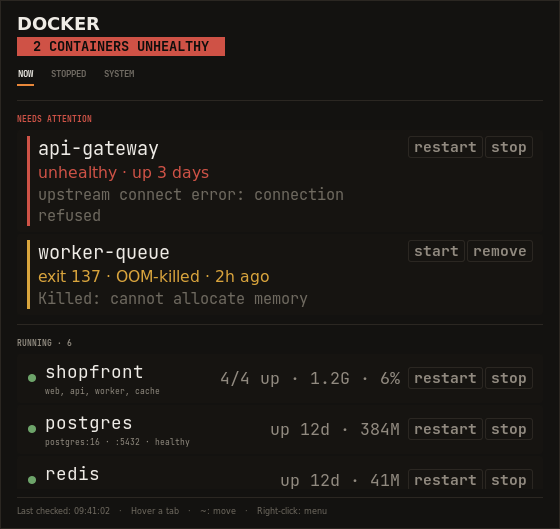

<p align="center">
  
</p>

<p align="center">
  <strong>ShinyWidgets</strong> — Docker Status Checker
</p>

<p align="center">
  <em>Real-time desktop widgets for your creative pipeline</em>
</p>

<p align="center">
  
  
  
  
</p>

---

A lightweight, always-on-top desktop indicator for **container health**. The value here is the exception, not the count: the dot stays quiet while everything is up, and goes red the moment a container turns unhealthy, starts restart-looping, or exits non-zero.

Reading the panel never needs a click. Changing things does: every row carries small `start` / `stop` / `restart` / `remove` buttons, and each one has to be clicked twice — the first click only arms it.

> **Part of the [ShinyWidgets](https://github.com/ShAInyXYZ) series** — small, focused desktop widgets that let you know what's happening in your software and pipeline at a glance. Zero clutter, zero noise, just the info you need.

---

<p align="center">
  
</p>


## What It Does

| Dot Color | Meaning |
|:-:|---|
| **Green** | All containers running and healthy |
| **Yellow** | Something exited non-zero |
| **Red** | A container is unhealthy or restart-looping |
| **Grey** | Docker daemon unreachable |

## Features

- **Three pages, switched by hover** — `NOW`, `STOPPED`, `SYSTEM`. Tabs sit under the title; rest the pointer on one and the page changes. A long page scrolls under a fixed header and footer
- **NOW** — *needs attention* first and in full: unhealthy, restart-looping, or crashed today, each with its exit code, OOM flag, restart count, when, and the last line the container logged. Then *running*, one row per compose stack (`7/7 up`, with which services are down when it is partial) or standalone container, with image, published port, health, live memory and CPU from `docker stats`
- **STOPPED** — every stack that is not running, nothing collapsed: *broken* (crashed, with the exit code, what it means — `139 · segfault`, `127 · command not found` — and the last log line), *stopped this week*, and *dormant*
- **SYSTEM** — engine and Compose versions, container / image / volume counts, and what `docker system df` says is reclaimable for images, stopped containers, build cache and volumes
- **Actions with a second click** — `stop` / `restart` on running rows, `start` / `remove` on stopped ones, `prune` on the SYSTEM page. The first click arms the button (`stop?` in amber, `remove?` / `prune?` in red); a second click within four seconds runs it, otherwise it disarms. The row reads `stopping…` until Docker answers, then a toast reports the outcome. Compose stacks are driven by project name (`docker compose -p name stop`), so start order and networks are Compose's business; volumes are never pruned from the panel
- **Health-aware** — uses Docker's own health status, so containers with a `HEALTHCHECK` are judged on it rather than on merely being up
- **Exit codes** — distinguishes a clean `exit 0` one-shot job from a real failure; `143` and a non-OOM `137` are recognised as `docker stop`, not crashes
- **Restart-loop detection** — a container stuck restarting is the failure mode that hides best in `docker ps`
- **Toasts on transition** — a container going unhealthy raises a notification immediately
- **Draggable · multi-monitor · `~` to reposition** — shared with every other ShinyWidget
- **Lightweight** — zero pip dependencies, Python standard library plus system GTK3

## Usage

```bash
./docker-status-checker.py

# or with system python (recommended if using conda/pyenv)
/usr/bin/python3 docker-status-checker.py
```

Requires permission to reach the Docker socket. If `docker info` works as your user, so does the widget; otherwise add yourself to the `docker` group:

```bash
sudo usermod -aG docker "$USER"   # log out and back in
```

### Controls

| Action | Effect |
|---|---|
| **Hover** | Opens the status detail panel; hover a tab to change page |
| **Click a row button** | Arms it (`stop?`); a second click within 4 s runs it |
| **Scroll** | Scrolls a page that is taller than the panel |
| **Click + Drag** | Repositions the dot |
| **`~` key** | Cycles all ShinyWidgets through screen sides (left/right, all monitors) |
| **Right-click** | Menu: refresh, widget actions, quit |

## Requirements

- Python 3.8+
- GTK3 with GObject Introspection
- Compositing window manager (for RGBA transparency)

The app **auto-detects your platform** at startup and adjusts accordingly. If GTK3 is missing, it prints platform-specific installation instructions.

<details>
<summary><strong>Linux</strong></summary>

GTK3 is pre-installed on most Linux desktops. If not:

**Debian / Ubuntu:**
```bash
sudo apt install python3-gi python3-gi-cairo gir1.2-gtk-3.0
```

**Fedora:**
```bash
sudo dnf install python3-gobject gtk3
```

**Arch:**
```bash
sudo pacman -S python-gobject gtk3
```

> **Note:** If you use conda/pyenv/virtualenv, the system `python3-gi` package may not be visible. Run with `/usr/bin/python3` or create a venv with `--system-site-packages`.

</details>

## Widget Coordination

ShinyWidgets are designed to work together. Press **`~`** on **any** widget and they all move together, stacked vertically with a 50px gap, cycling through the left and right edges of every connected monitor.

The coordination works via a shared directory (`~/.config/status-widgets/`):
- Each widget registers itself with a JSON file on startup
- A shared `corner.json` stores the current position index
- All widgets poll this file 5 times/sec and reposition when it changes
- Stale registrations (dead PIDs) are automatically cleaned up

## How It Works

One `docker ps -aq` and one `docker inspect` over every container per poll, with a Go template that pulls exactly the fields the panel needs — state, exit code, OOM flag, start and finish times, restart count, health, image, compose labels, restart policy, published ports — so there is no SDK and no status-string parsing. `docker stats --no-stream` adds live memory and CPU for whatever is running. The last log line is fetched only for broken or unhealthy containers, and cached per stop time, so a container that crashed months ago costs one `docker logs` call ever. `docker system df` is slow, so the SYSTEM page refreshes every five minutes and right after a prune.

Compose stacks are grouped by the `com.docker.compose.project` label, so a seven-container stack reads as one row, and its buttons drive the whole stack through `docker compose -p <project>` — falling back to plain `docker stop` / `start` on the member containers when Compose is not installed.

Actions run on a background thread; the row shows `stopping…` meanwhile and the widget refreshes as soon as Docker answers.

## ShinyWidgets Family

| Widget | Monitors | Repo |
|---|---|---|
| **Claude Status** | Anthropic API health, plan limits, incidents | [claude-status-checker](https://github.com/ShAInyXYZ/claude-status-checker) |
| **ComfyUI Status** | ComfyUI generation queue, GPU/VRAM, progress | [comfyui-status-checker](https://github.com/ShAInyXYZ/comfyui-status-checker) |
| **Disk Status** | Filesystem pressure, Docker reclaimable space | [disk-status-checker](https://github.com/ShAInyXYZ/disk-status-checker) |
| **Docker Status** | Container health, restart loops, failed exits | [docker-status-checker](https://github.com/ShAInyXYZ/docker-status-checker) |
| **Tailscale Status** | Tailnet reachability, key expiry, exit nodes | [tailscale-status-checker](https://github.com/ShAInyXYZ/tailscale-status-checker) |

## Design

The interface follows **Emberdeck**: warm charcoal (never pure black, never blue-black), a flat three-step surface ladder with 1px hairlines instead of shadows or gradients, and colour reserved for meaning rather than decoration. Healthy things read as quiet grey text so that a problem is the only thing on the panel competing for your attention.

Shared runtime lives in [`shinywidget.py`](../../core/shinywidget.py) — coordination, palette, the dot/panel/toast windows, and the declarative panel primitives (`Section`, `Row`, `Meter`, `Note`, `Alert`, `Grid`, `Action`). A widget supplies `fetch()` and `rows()`, and optionally `pages()` for a tabbed panel; `Row(..., actions=[Action(label, callback, confirm=..., danger=...)])` is all it takes to put a confirmed button on a row.

## License

MIT — see [LICENSE](LICENSE).
