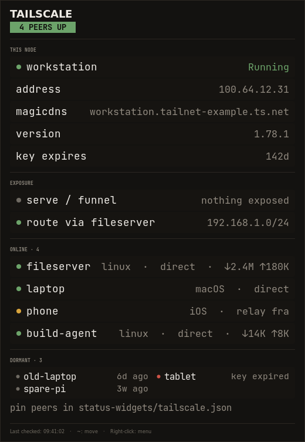

<p align="center">
  
</p>

<p align="center">
  <strong>ShinyWidgets</strong> — Tailscale Status Checker
</p>

<p align="center">
  <em>Real-time desktop widgets for your creative pipeline</em>
</p>

<p align="center">
  
  
  
  
</p>

---

A lightweight, always-on-top desktop indicator for your **tailnet**. Deliberately narrow: in a long-lived tailnet most peers are dormant, and alerting on them is pure noise. What matters is whether *this* node is up and authenticated, whether the peers you actually depend on are reachable, and whether an exit node is silently routing your traffic.

> **Part of the [ShinyWidgets](https://github.com/ShAInyXYZ) series** — small, focused desktop widgets that let you know what's happening in your software and pipeline at a glance. Zero clutter, zero noise, just the info you need.

---

<p align="center">
  
</p>


## What It Does

| Dot Color | Meaning |
|:-:|---|
| **Green** | Node running, watched peers reachable |
| **Yellow** | A watched peer is offline, or the node key expires soon |
| **Red** | `tailscaled` stopped, logged out, or this node offline |
| **Grey** | `tailscaled` unreachable |

## Features

- **Watched peers, not all peers** — pin the machines you depend on; everything else is counted as dormant and never raises an alert
- **Key expiry warning** — the classic silent tailnet outage is a node key quietly expiring. Warns at 7 days, while you can still re-authenticate
- **Exit node visibility** — an exit node changes where all your traffic comes from. If one is active, it's on the panel in amber
- **Toasts on transition** — a watched peer dropping, or the daemon stopping, raises a notification
- **Draggable · multi-monitor · `~` to reposition** — shared with every other ShinyWidget
- **Lightweight** — zero pip dependencies, Python standard library plus system GTK3

## Choosing which peers to watch

Create `~/.config/status-widgets/tailscale.json`:

```json
{"watch": ["shiny-nas", "build-box"]}
```

Hostnames are matched case-insensitively. With no config file, the widget watches any peer it sees online while running — useful immediately, but pinning is better: it means a machine that's *supposed* to be up still alerts when it's down at startup.

## Usage

```bash
./tailscale-status-checker.py

# or with system python (recommended if using conda/pyenv)
/usr/bin/python3 tailscale-status-checker.py
```

### Controls

| Action | Effect |
|---|---|
| **Hover** | Opens the status detail panel |
| **Click + Drag** | Repositions the dot |
| **`~` key** | Cycles all ShinyWidgets through screen sides (left/right, all monitors) |
| **Right-click** | Menu: refresh, widget actions, quit |

## Requirements

- Python 3.8+
- GTK3 with GObject Introspection
- Compositing window manager (for RGBA transparency)

The app **auto-detects your platform** at startup and adjusts accordingly. If GTK3 is missing, it prints platform-specific installation instructions.

<details>
<summary><strong>Linux</strong></summary>

GTK3 is pre-installed on most Linux desktops. If not:

**Debian / Ubuntu:**
```bash
sudo apt install python3-gi python3-gi-cairo gir1.2-gtk-3.0
```

**Fedora:**
```bash
sudo dnf install python3-gobject gtk3
```

**Arch:**
```bash
sudo pacman -S python-gobject gtk3
```

> **Note:** If you use conda/pyenv/virtualenv, the system `python3-gi` package may not be visible. Run with `/usr/bin/python3` or create a venv with `--system-site-packages`.

</details>

## Widget Coordination

ShinyWidgets are designed to work together. Press **`~`** on **any** widget and they all move together, stacked vertically with a 50px gap, cycling through the left and right edges of every connected monitor.

The coordination works via a shared directory (`~/.config/status-widgets/`):
- Each widget registers itself with a JSON file on startup
- A shared `corner.json` stores the current position index
- All widgets poll this file 5 times/sec and reposition when it changes
- Stale registrations (dead PIDs) are automatically cleaned up

## How It Works

One `tailscale status --json` call per poll — the same data the CLI prints, read as JSON rather than scraped. No API key, no control-plane calls of its own, nothing leaves your machine.

Your tailnet name is deliberately **not** displayed: for most accounts it's an email address, and this widget sits permanently on screen.

## Privacy

Everything is local. The widget talks only to the `tailscaled` daemon already running on this machine, and displays hostnames you already own. No tailnet name, no account identifier, and no IP addresses are rendered.

## ShinyWidgets Family

| Widget | Monitors | Repo |
|---|---|---|
| **Claude Status** | Anthropic API health, plan limits, incidents | [claude-status-checker](https://github.com/ShAInyXYZ/claude-status-checker) |
| **ComfyUI Status** | ComfyUI generation queue, GPU/VRAM, progress | [comfyui-status-checker](https://github.com/ShAInyXYZ/comfyui-status-checker) |
| **Disk Status** | Filesystem pressure, Docker reclaimable space | [disk-status-checker](https://github.com/ShAInyXYZ/disk-status-checker) |
| **Docker Status** | Container health, restart loops, failed exits | [docker-status-checker](https://github.com/ShAInyXYZ/docker-status-checker) |
| **Tailscale Status** | Tailnet reachability, key expiry, exit nodes | [tailscale-status-checker](https://github.com/ShAInyXYZ/tailscale-status-checker) |

## Design

The interface follows **Emberdeck**: warm charcoal (never pure black, never blue-black), a flat three-step surface ladder with 1px hairlines instead of shadows or gradients, and colour reserved for meaning rather than decoration. Healthy things read as quiet grey text so that a problem is the only thing on the panel competing for your attention.

Shared runtime lives in [`shinywidget.py`](shinywidget.py) — coordination, palette, the dot/panel/toast windows, and the declarative panel primitives (`Section`, `Row`, `Meter`, `Note`, `Alert`). A widget only supplies `fetch()` and `rows()`.

## License

MIT — see [LICENSE](LICENSE).
